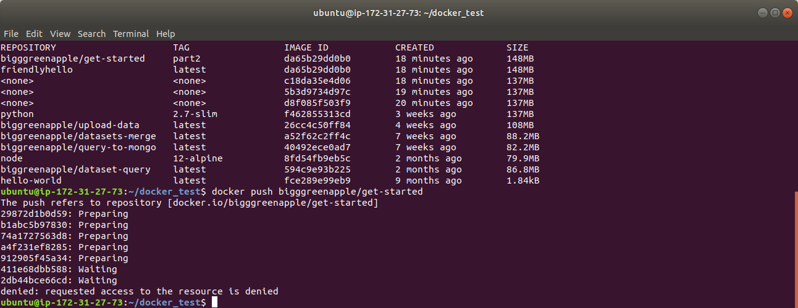

# containers  
**create Dockerfile**  
  
  
**create app.py**  
  
`docker build --tag=friendlyhello .`  
  
`docker image ls`  
  
`docker run -p 4000:80 friendlyhello`  
  
`curl http://localhost:4000`  
  
`docker login`  
  
`docker image ls`  
  
`docker push bigggreenapple/get-started`  
  
