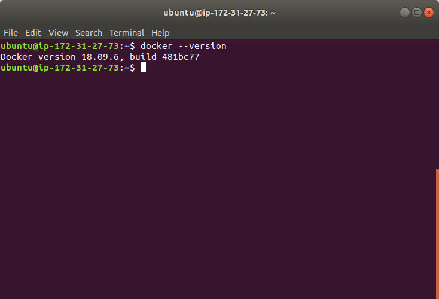
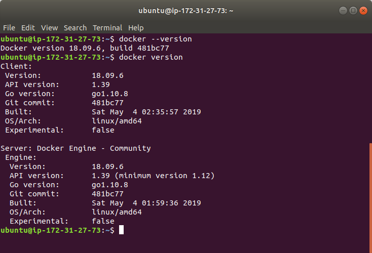
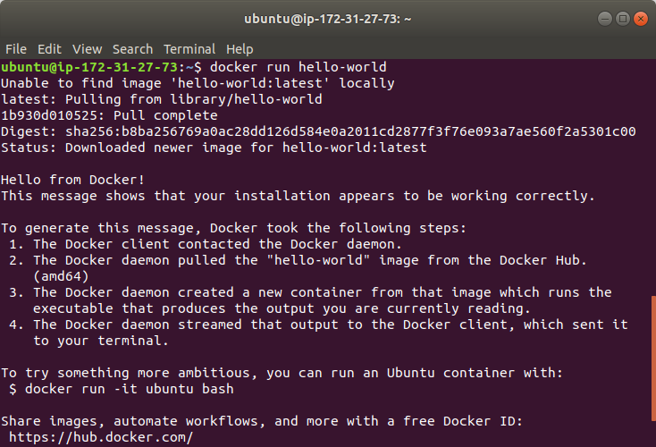
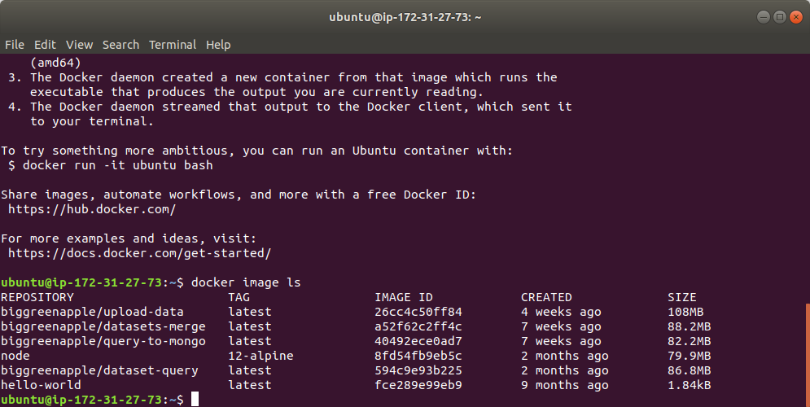
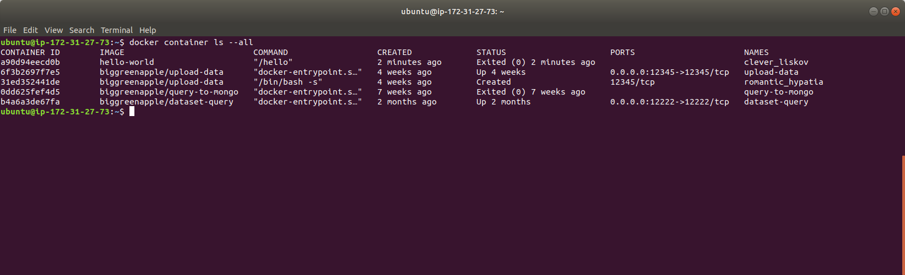

# orientation  
This Markdown file takes a record what i got when I went through the Docker orienttaion.  
Since I installed Docker before, I will start from the version check.  
`docker --version`  
  
`docker version`  
  
`docker run hello-world`  
  
`docker image ls`  
  
`docker container ls --all`  
  
