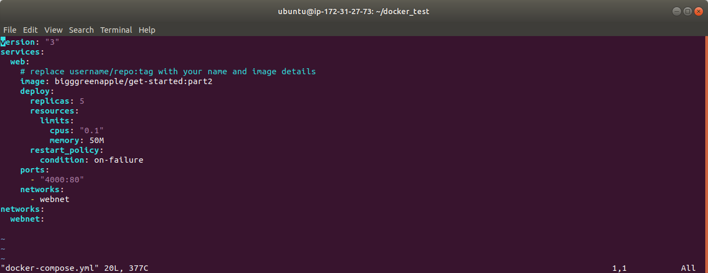
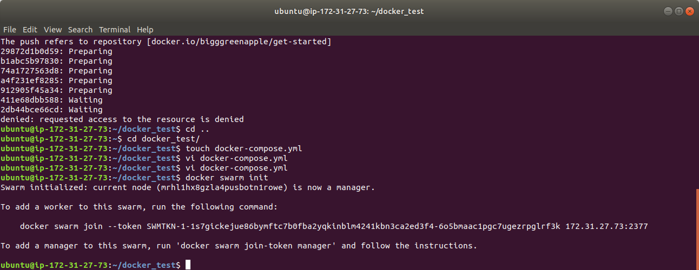
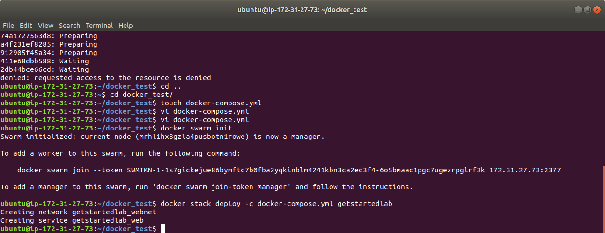
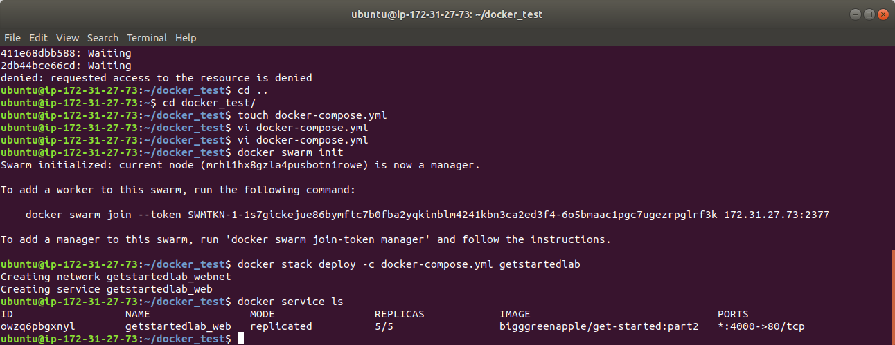
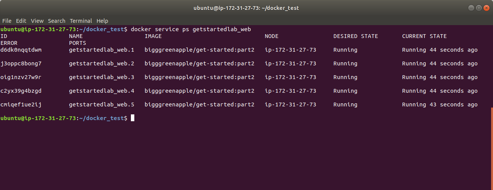
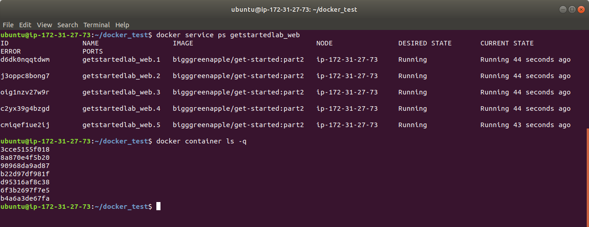
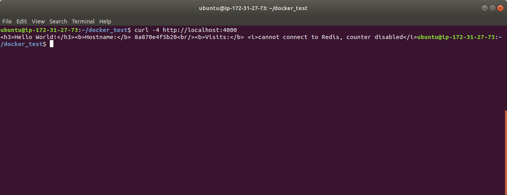
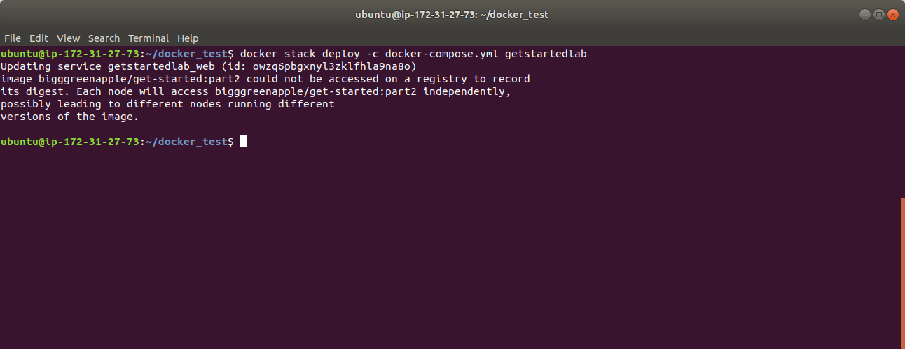
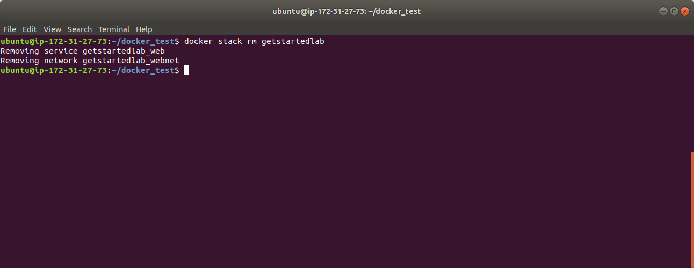
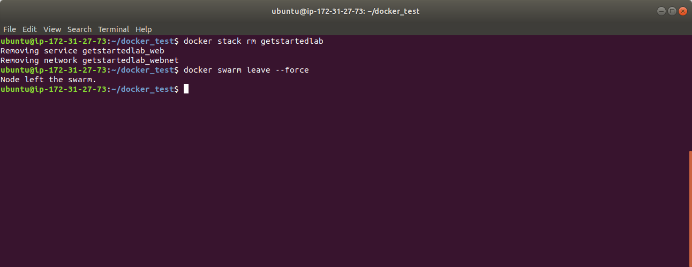

# services  
**create docker-compose.yml**  
  
`docker swarm init`  
  
`docker stack deploy -c docker-compose.yml getstartedlab`  
  
`docker service ls`  
  
`docker service ps getstartedlab_web`  
  
`docker container ls -q`  
  
`curl -4 http://localhost:4000`  
  
`docker stack deploy -c docker-compose.yml getstartedlab`  
  
`docker stack rm getstartedlab`  
  
`docker swarm leave --force`  
  
